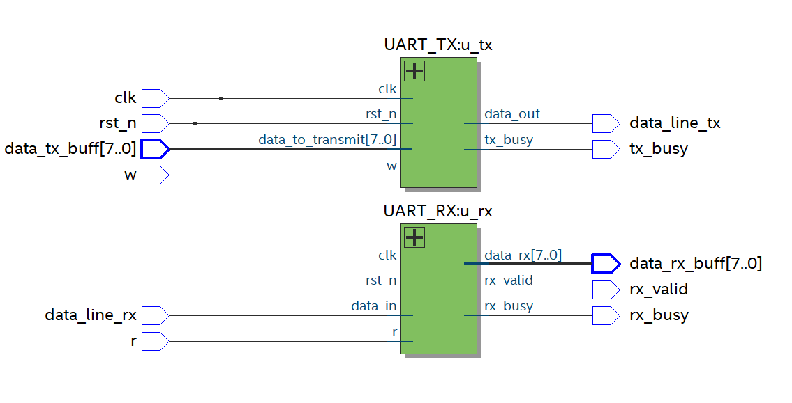

# UART — Architecture Document

> **Living document** — updated continuously as the design progresses.
> Target device: Intel Cyclone IV E **EP4CE6E22C8** · Quartus Prime **20.1.0 Lite**
> Top-level entity: `UART` (`UART.vhd`) — **implemented and verified** (RTL complete, TB suite green, Analysis & Elaboration clean)

---

## 1. System Overview

Classic **full-duplex** UART link implemented as two independent blocks under one top-level wrapper:

- **`UART_TX:u_tx`** — parallel byte in (`w`, `data_tx_buff`), 8N1 serial frame out (`data_line_tx`).
- **`UART_RX:u_rx`** — asynchronous serial line in (`data_line_rx`), parallel byte out (`data_rx_buff`) with a `rx_valid` strobe.

TX and RX are completely independent machines (no shared resource except `clk`): they transmit and receive simultaneously. The wrapper forwards the master's requests unchanged — no cross-gating.

### 1.1 Module hierarchy

```
UART (top level, pure structural wrapper)
│
├── UART_TX:u_tx
│   ├── baudrate_gen:u_brg        — tick generator (enable-gated divider, G_PHASE_OFFSET = 0)
│   ├── parallel_to_serial:u_p2s  — 8-bit load/shift register, LSB first
│   └── FSM + framing + registered outputs
│       (IDLE/START_BIT/DATA_BITS/STOP_BIT, 3-bit bit counter,
│        output mux + data_out_r / tx_busy_r — the "SSBG/BRSG" roles
│        of the original plan, folded into the FSM during implementation)
│
└── UART_RX:u_rx
    ├── input synchronizer        — 2-FF chain on the asynchronous RXD pin
    ├── baudrate_gen:u_brg        — same BRG, G_PHASE_OFFSET = divider/2 (mid-bit grid)
    ├── serial_to_parallel:u_s2p  — 8-bit shift register, LSB first
    └── FSM + registered outputs  — start detection, count, rx_valid_r / rx_busy_r
```

### 1.2 Top-level RTL view



*Post-elaboration netlist of the wrapper (`Analysis & Elaboration`, Cyclone IV E): the two instances with the master interface forwarded unchanged. Thick line = 8-bit bus (`data_tx_buff` in, `data_rx_buff` out).*

---

## 2. Module Map

| Module | Parent | Role | Status |
|---|---|---|---|
| `UART` | — | Pure structural wrapper: forwards `w`/`r`, propagates `G_CLK_FREQ`/`G_BAUD` | ✅ |
| `UART_TX` | `UART` | Frames an 8N1 stream: FSM + framing mux + registered outputs | ✅ |
| `baudrate_gen` (×2) | `UART_TX` / `UART_RX` | Clock divider → 1-clk `baud_tick`; `enable`-gated; phase preload `G_PHASE_OFFSET` | ✅ |
| `parallel_to_serial` (P2S) | `UART_TX` | 8-bit load/shift register, LSB-first serial out | ✅ |
| `UART_RX` | `UART` | 2-FF input sync + start-edge re-armed FSM + mid-bit sampling + registered outputs | ✅ |
| `serial_to_parallel` (S2P) | `UART_RX` | 8-bit shift register, LSB-first parallel out | ✅ |

> Historical note: the original plan split the TX into four blocks (P2S, BRG, **SSBG**, **BRSG**). During implementation the SSBG role (start/stop insertion) folded into the `UART_TX` FSM framing mux, and the BRSG role (busy/ready) into the registered `tx_busy_r` — see changelog 0.5 / 1.2.

### 2.1 Source files (all registered in `UART.qsf`)

| File | Content |
|---|---|
| `UART.vhd` | `UART` top wrapper |
| `UART_TX.vhd` | `UART_TX` (instantiates BRG + P2S) |
| `UART_RX.vhd` | `UART_RX` (instantiates 2-FF sync + BRG + S2P) |
| `baudrate_gen.vhd` | `baudrate_gen` — one module, two instances |
| `parallel_to_serial.vhd` | `parallel_to_serial` (P2S) |
| `serial_to_parallel.vhd` | `serial_to_parallel` (S2P) |

### 2.2 Simulation folders (one project = one DUT = one TB)

| Folder | Testbench | Scope |
|---|---|---|
| `sim_baudrate/` | `baudrate_gen_tb.vhd` (+ `sim_run.do`) | BRG tick period / reset alignment |
| `sim_parallel_to_serial/` | `parallel_to_serial_tb.vhd` | P2S load + shift order |
| `sim_serial_to_parallel/` | `serial_to_parallel_tb.vhd` | S2P bit-to-byte rebuild |
| `sim_uart_tx/` | `UART_TX_tb.vhd` | TX stimulus (wave inspection) |
| `sim_uart_rx/` | `UART_RX_tb.vhd` | RX frame decode (self-checking) |
| `sim_uart/` | `UART_tb.vhd` | Top-level 2-frame loopback (self-checking) |

All TBs are simulation-only and are **not** registered in `UART.qsf`.

---

## 3. Top-Level — `UART`

Pure structural wrapper: forwards the master's requests **unchanged** (full-duplex — no cross-gating between TX and RX) and propagates `G_CLK_FREQ` / `G_BAUD` down via `generic map`.

### 3.1 External interface (as implemented)

| Signal | Dir | Width | Description |
|---|---|---|---|
| `clk` | in | 1 | System clock |
| `rst_n` | in | 1 | Reset, active-low (synchronous inside the blocks) |
| `w` | in | 1 | TX request — level-sensitive, sampled only in IDLE; held high → back-to-back frames |
| `r` | in | 1 | RX arm — '1' = receiver listening; re-arms automatically after each frame while high |
| `data_tx_buff[7:0]` | in | 8 | Byte to transmit (latched at frame start; keep stable while `w` is sampled) |
| `data_line_rx` | in | 1 | Serial RXD line (**asynchronous** — synchronized inside `UART_RX`) |
| `data_line_tx` | out | 1 | Serial TXD line (registered, glitch-free) |
| `tx_busy` | out | 1 | '1' during a TX frame (start bit → stop bit) |
| `rx_busy` | out | 1 | '1' while the RX FSM is not IDLE |
| `rx_valid` | out | 1 | 1-clock strobe: `data_rx_buff` holds a new received byte |
| `data_rx_buff[7:0]` | out | 8 | Received byte (held until the next frame completes) |

### 3.2 Utilizzatore contract

- **Send:** wait `tx_busy = '0'` → drive `data_tx_buff` → pulse `w` (≥ 1 clk). Requests are sampled **only in IDLE**: asserting during busy never corrupts anything, but a pulse entirely inside a frame is silently dropped.
- **Receive:** keep `r = '1'` (always listening); read `data_rx_buff` on each `rx_valid` pulse.
- `w`, `r`, `data_tx_buff` must be **synchronous to `clk`** (same clock domain as the UART). A producer on a different clock must synchronize/handshake upstream of this block.
- Full-duplex: `w` while `rx_busy`, or `r` while `tx_busy`, is legal and normal — the two machines share nothing.
- Known limitation: no overrun detection — if a second frame completes before the master reads `data_rx_buff`, the first byte is lost (roadmap §8).

---

## 4. Transmitter — `UART_TX`

### 4.1 Structure

```
 w ──────────┐
 data_tx_buff┴─► [FSM: IDLE → START_BIT → DATA_BITS → STOP_BIT] ──► [output mux] ─► [data_out_r] ─► data_out (TXD)
 clk ───────────────┐        │                │
                    │   baud_tick       count[2:0]
                    │        │
                    │   [baudrate_gen:u_brg — enable = state /= IDLE, G_PHASE_OFFSET = 0]
                    │
                    └─► [parallel_to_serial:u_p2s — load = IDLE∧w, shift = DATA_BITS∧tick]
                              │
                              └── data_out_b (bit on deck) ──► output mux (DATA_BITS branch)
```

Key signals:

- `load = (state = IDLE) and w` → the P2S latches the byte at frame start; `data_tx_buff` may change freely afterwards.
- `shift = (state = DATA_BITS) and baud_tick` → **combinational on purpose**: consumed only by the P2S clocked process, so its sub-cycle hazard is never sampled.
- Output mux: IDLE→`'1'`, START_BIT→`'0'`, DATA_BITS→`data_out_b`, STOP_BIT→`'1'` — sampled at every clk edge into `data_out_r`. Effect: the whole frame is uniformly delayed by one clock, bit cells keep their `divider` width, and the pin sees a glitch-free registered signal.
- `tx_busy_r <= (state /= IDLE)` — registered status.

### 4.2 P2S — actual interface

| Signal | Dir | Description |
|---|---|---|
| `clk`, `rst_n` | in | Clock / active-low reset |
| `load` | in | Load `data_in` into the shift register |
| `shift` | in | Shift right, `'0'` in at MSB |
| `data_in[7:0]` | in | Byte to serialize |
| `data_out` | out | LSB of the register = next bit on deck |

### 4.3 BRG — actual interface (one module, two instances)

| Item | Dir | Description |
|---|---|---|
| `G_PHASE_OFFSET` | generic | Counter preload while disabled (TX: 0; RX: `divider/2`) |
| `clk`, `rst_n` | in | Clock / active-low reset |
| `enable` | in | '1' = counter runs; '0' = counter holds the preload |
| `divider` | in | natural — tick period in clock cycles (`≥ 2`) |
| `baud_tick` | out | **Combinational** terminal-count pulse, gated by `enable` |

`divider = G_CLK_FREQ / G_BAUD` (50 MHz / 115200 = 433 → +0.24 % error, well within UART tolerance). The tick is combinational on the terminal count so the first tick lands exactly `divider` edges after `enable` rises — a registered tick would stretch the start bit to `divider+1` clocks (framing error).

### 4.4 Frame format (8N1)

```
        idle   start   b0   b1   b2   b3   b4   b5   b6   b7   stop   idle
 line: ─────┐      ┌────┐                                 ┌─────────┐     ┌──────
            └──────┘    └─────────────────────────────────┘         └─────┘
              (1)    (0)   LSB ───────────────────────── MSB           (1)
```

Parity / multi-stop: not implemented in v1 (roadmap §8).

### 4.5 Transmit sequence

1. **IDLE:** line `'1'`, `tx_busy = '0'`.
2. `w = '1'` sampled in IDLE → P2S loads `data_tx_buff`, FSM → START_BIT (`tx_busy` rises).
3. **Start bit** `'0'` for `divider` clocks.
4. **D0…D7 LSB-first**, `divider` clocks each (P2S shifts once per tick).
5. **Stop bit** `'1'` for `divider` clocks.
6. FSM → IDLE; if `w` is still high, the next frame starts immediately (back-to-back), latching the current `data_tx_buff`.

---

## 5. Receiver — `UART_RX`

### 5.1 Input synchronizer (the CDC front-door)

`data_in → [data_in_meta] → [data_in_sync]` — two flip-flops, reset to idle `'1'`.

- RXD is **asynchronous by definition** (driven by the remote transmitter's own clock): the first stage may go metastable, the second stage gives the downstream logic a clean sample.
- **`data_in_sync` is the only signal read downstream** (FSM start detection, `baud_enable`, S2P data input). The raw pin is never used elsewhere.
- Cost: 2–3 clocks of constant detection latency, absorbed by the tick re-arm — requires `divider/2 > 3` (true for real dividers, e.g. 434; the RX TB uses divider = 10 for this reason).

### 5.2 FSM

States: `IDLE → WAIT_START_BIT → START_BIT → DATA_BITS → STOP_BIT → IDLE`.

- `r` is consumed **only in IDLE**: arming/disarming can never disturb a frame in progress; with `r` held high the receiver re-arms automatically after each frame.
- `baud_enable` is sticky: it rises when a start is detected (`WAIT_START_BIT` ∧ `data_in_sync = '0'`) and is held through the whole frame → the BRG phase is **re-armed on every detected start edge** (counter preloaded with `G_PHASE_OFFSET = divider/2`), so the idle-gap length is irrelevant.
- `START_BIT` consumes the mid-start tick; from then on the ticks hit mid-bit positions.
- `rx_valid_r`: registered strobe, set on the STOP_BIT tick (mid-stop). Registered — glitch-free (changelog 1.1).
- `rx_busy_r`: registered `state /= IDLE`.

### 5.3 S2P — actual interface

| Signal | Dir | Description |
|---|---|---|
| `clk`, `rst_n` | in | Clock / active-low reset |
| `shift` | in | Shift right, `'0'` in at MSB (gated by DATA_BITS ∧ tick) |
| `data_in` | in | Serial bit = `data_in_sync` |
| `data_out` | out | 8-bit register output = `data_rx` (held until the next frame) |

Bit order LSB-first — mirrors the P2S exactly (first received bit lands in bit 0).

---

## 6. Design decisions

| # | Decision | Status |
|---|---|---|
| 1 | Frame 8N1, LSB-first, no parity in v1 | ✅ |
| 2 | Two independent FSMs — full duplex, no shared resources | ✅ |
| 3 | `divider ≥ 2` (`divider = 0/1` unsupported: continuous tick / hang) | ✅ |
| 4 | Single-byte buffering on both sides; **no overrun detection yet** | 🚧 |
| 5 | Reset: active-low `rst_n`, synchronous inside the blocks; board-level reset synchronizer still to add | ✅ / 🚧 |
| 6 | Data source/sink: the master interface itself (`w` / `r` / `data_tx_buff` / `data_rx_buff`) | ✅ |
| 7 | RX sampling: mid-bit via `G_PHASE_OFFSET = divider/2` + tick phase re-armed on every detected start edge (16× oversampling only if real async links with glitch filtering become a requirement) | ✅ |
| 8 | Language: VHDL | ✅ |
| 9 | `G_CLK_FREQ` / `G_BAUD` generics on the top entity, propagated down; `divider` derived once in TX/RX | ✅ |
| 10 | Every module output is FF-driven (registered outputs at all module boundaries) | ✅ |
| 11 | 2-FF synchronizer on RXD — the only asynchronous input | ✅ |
| 12 | No cross-gating between TX and RX; the wrapper forwards `w`/`r` unchanged | ✅ |
| 13 | `w`/`r` are level-sensitive and sampled only in IDLE; a pulse entirely inside busy is silently dropped — the master checks the busy flags first | ✅ contract |

---

## 7. Verification

| TB | Folder | Scope | Status |
|---|---|---|---|
| `baudrate_gen_tb` | `sim_baudrate/` | tick period = divider, reset alignment, pulse width; dividers 4/10/433/5208 + mid-run reset | ✅ PASS (43 ticks, 0 errors) |
| `parallel_to_serial_tb` | `sim_parallel_to_serial/` | load + LSB-first shift sequence | ✅ PASS |
| `serial_to_parallel_tb` | `sim_serial_to_parallel/` | rebuild of `0xA5` / `0xC3` bit-per-bit | ✅ PASS |
| `UART_TX_tb` | `sim_uart_tx/` | TX stimulus + wave inspection (no asserts — TX is covered end-to-end by the top TB) | ✅ clean |
| `UART_RX_tb` | `sim_uart_rx/` | frame `0xA5` decode with a deliberately misaligned idle gap (divider = 10) | ✅ PASS |
| `UART_tb` | `sim_uart/` | top-level loopback: 2 frames (`0xA5`, `0x3C`), exactly 2 `rx_valid` pulses, `tx_busy` released | ✅ PASS |

Run notes (all TBs):

- One ModelSim project per folder; compile the RTL from the parent folder + the local TB; add the signals to the Wave window **before** running.
- TBs are portable across VHDL-93/2002/2008 (local `to_hex` helpers instead of `to_hstring`); the project default is 2002 — switch to 2008 if you use 2008-only constructs.
- Run with a **finite time** (e.g. `run 6 us`), not `run -all`: the free-running clock never ends the simulation.
- `baudrate_gen_tb` also runs head-less: `vsim -c -do sim_run.do` (prints the PASS/FAIL verdict).

**Quartus Analysis & Elaboration:** successful — **0 errors, 0 inferred latches**, 1 tool-configuration warning (`NUM_PARALLEL_PROCESSORS`).

---

## 8. Roadmap

- **RX framing-error detection**: check `data_in_sync = '1'` at the mid-stop tick → `rx_error` flag (also identifies the garbage byte captured when arming mid-frame).
- **RX overrun flag / small FIFO**: today a second completed frame silently overwrites `data_rx_buff`.
- Parity option (E/O) and 1.5/2 stop bits.
- **Board reset synchronizer** on the `rst_n` pin at the top of the system hierarchy.
- SDC constraints: `set_false_path` RXD → first sync FF, `set_output_delay` on TXD; then Fitter + timing sign-off.
- Half-duplex direction management (TX tri-state `tx_oe` or RS-485 transceiver `DE`) if a shared wire is used.

---

## 9. Changelog

| Version | Date | Changes |
|---|---|---|
| 0.1 | 2026-09-04 | Initial skeleton from module list: top-level + TX blocks (P2S, BRG, SSBG, BRSG); RX placeholder |
| 0.2 | 2026-09-04 | Created placeholder source files `UART_TX.vhd`, `baudrate_gen.vhd`, `parallel_to_serial.vhd`; added §2.1 source-file map |
| 0.3 | 2026-09-04 | BRG template added (entity `baudrate_gen`, clk/rst); registered `baudrate_gen.vhd` in `UART.qsf`; validated via Analysis & Elaboration |
| 0.4 | 2026-09-04 | BRG first implementation (runtime `divider` input, active-low `rst_n`, `baud_tick` out); §4.3 updated to actual interface; UART_TX instantiation guidance |
| 0.5 | 2026-09-04 | Decision #9: clock/baud configuration provided from top (`UART`) as generics `G_CLK_FREQ`/`G_BAUD`, propagated via generic map; `divider` derived in `UART_TX` |
| 0.6 | 2026-09-04 | Added self-checking testbench `baudrate_gen_tb.vhd` (+ `sim_run.do`); added §7 Verification; local ModelSim run blocked by missing VC++ 2013 x86 runtime |
| 0.7 | 2026-09-04 | Installed VC++ 2013 x86 runtime (missing `msvcr120.dll`/`msvcp120.dll`); executed `baudrate_gen_tb` in ModelSim: **PASS — 42 ticks checked, 0 errors** |
| 0.8 | 2026-09-04 | Organized simulation into `sim_baudrate/` (TB, `sim_run.do`, `work`, `.mpf`); cleaned root artifacts; re-ran from new location: **PASS — 42 ticks, 0 errors** |
| 0.9 | 2026-09-06 | BRG `baud_tick` switched from registered to combinational terminal-count pulse (gated by `enable`): removes the one-cycle latency that stretched the TX start bit to `divider+1` clocks; §4.3/§7 updated; BRG TB re-verified (**43 ticks, 0 errors**) + new frame-level TX check: **4 frames, 0 errors** (incl. back-to-back) |
| 1.0 | 2026-09-06 | RX tick phase re-sync: BRG gains `G_PHASE_OFFSET` generic (counter preload while disabled, default 0 → TX unchanged); `UART_RX` re-arms the tick phase on the **detected start edge** (enable sticky through the frame, new `START_BIT` state) and samples **mid-bit** — idle-gap alignment no longer required (decision #7 closed); new self-checking `sim_uart_rx/UART_RX_tb.vhd`: frame `0xA5` decoded with a deliberately misaligned gap, **0 errors**; BRG TB re-verified (**43 ticks, 0 errors**), TX TB clean |
| 1.1 | 2026-09-06 | `UART_RX`: `rx_valid` converted from combinatorial decode to **registered strobe** (set in the clocked process on `state = STOP_BIT` + tick): removes the 1-delta glitch seen when `STOP_BIT` is entered while the previous tick is still high; `shift` stays combinatorial (consumed only by the S2P register on clk edges); TB event-log check: rx_valid transitions 4 → **2** (clean single pulse), frame still decodes `0xA5`, **0 errors** |
| 1.2 | 2026-09-06 | Board-ready I/O registers (reusable-module style: **every module output is FF-driven**): `UART_TX` drives `data_out` from a registered output mux (TXD glitch-free at the pin; frame uniformly delayed 1 clk, bit cells unchanged; reset to idle `'1'`) and `tx_busy` from a register; `UART_RX` adds a **2-FF synchronizer** on the asynchronous RXD pin (`data_in_sync` is the only signal read by FSM/`baud_enable`/S2P) and a registered `rx_busy`; RX TB divider raised 4 → 10 (sync latency 2–3 clk must stay below `divider/2`); end-to-end TX→RX loopback re-verified: `0xA5` decoded, 0 errors |
| 1.3 | 2026-09-06 | Top-level `UART` wrapper completed (both instances + generic propagation). Fix: the master's `w`/`r` were left unconnected while the block requests were synthesized from the busy flags (`w_ready <= not tx_busy and not rx_busy`) → TX transmitted continuously and reception was masked during TX frames; now the requests are **forwarded unchanged** (full-duplex: no cross-gating). Verified with a 2-frame top-level loopback TB (`0xA5`, `0x3C`, `r` held high → auto re-arm): both bytes decoded, 2 `rx_valid` pulses, **0 errors** |
| 1.4 | 2026-09-07 | New top-level testbench `sim_uart/UART_tb.vhd` (`tb_UART`, minimal template style, self-checking): wires `data_line_tx` → `data_line_rx` (board-style loopback), sends two frames (`0xA5`, `0x3C`) with `r` held high, asserts both bytes + exactly 2 `rx_valid` pulses + `tx_busy` released; portable to VHDL-93/2002 (local `to_hex` helper). Re-verified: **0 errors, 0 warnings**. NB: run with a finite time (`run 6 us`), not `run -all` (free-running clock) |
| 1.5 | 2026-09-07 | **Documentation rebuilt to match the implemented architecture**: §1 hierarchy + §2 module/source/sim maps rewritten (RX implemented; SSBG/BRSG roles folded into the TX FSM + registered outputs), §3 actual interface + utilizzatore contract, §4/§5 rewritten to the actual RTL (BRG `G_PHASE_OFFSET`/`enable`, TX registered outputs, RX 2-FF sync + FSM), decisions #10–#13 added, §7 verification matrix for all six TBs, §8 roadmap; top-level RTL-viewer screenshot added (`doc/UART_top_RTL_viewer.png`) |